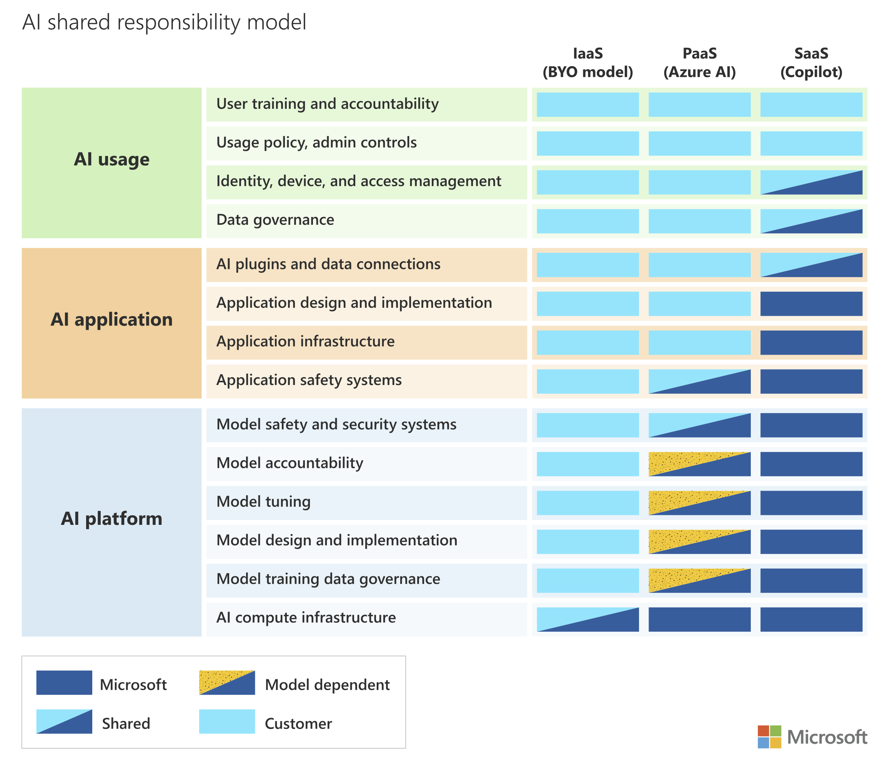

# Ciberseguridad e Inteligencia Artificial

## [Inteligencia artificial Ética y Responsable.](inteligencia-artificial-etica-y-responsable.md)

## [Modelo de responsabilidad compartida](modelo-de-responsabilidad-compartida-de-la-inteligencia-artificial-ia.md)&#x20;

<figure><figcaption></figcaption></figure>

## [Servicios cognitivos disponibles en Microsoft Azure.](../ai-+-machine-learning/servicios-cognitivos-disponibles-en-microsoft-azure.md)

## [GPT-RAG Arquitectura de Referencia](gpt-rag-arquitectura-de-referencia.md)

## [Microsoft Copilot](../microsoft-copilot/)

### [Copilot: Adopción Segura](../microsoft-copilot/copilot-adopcion-segura.md)

### Inteligencia Artificial embebidas en las soluciones de seguridad de Microsoft.

Extender las capacidades de las herramientas de seguirdad de Microsoft utilizando Inteligencia Artificial y servicios de terceros.

Sentinel y GPT

### Copilot for Security

