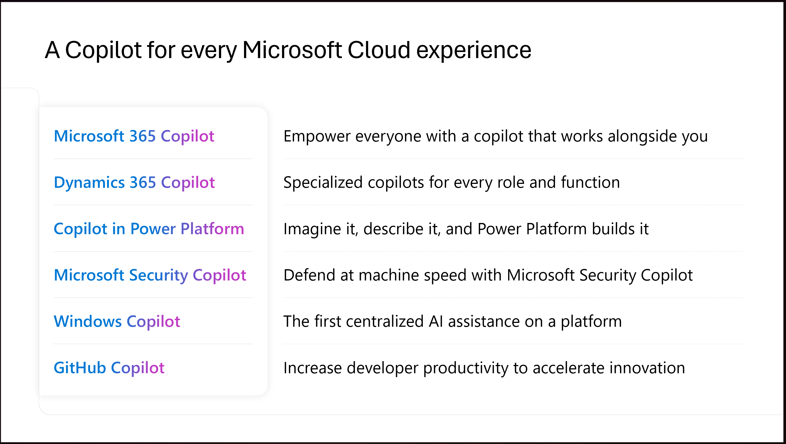

# Ciberseguridad e Inteligencia Artificial

## Inteligencia artificial Etica y Reponsable.



## Modelo de responsabilidad compartida&#x20;

## Servicios cognitivos disponibles en Microsoft Azure.

### Azure OpenAI

#### GPT-RAG

Preguntas?

Arquitectura Zero Trust.&#x20;

## Microsoft Copilot

<figure><figcaption></figcaption></figure>

### Copilot M365

Preguntas??

#### Consideraciones de seguridad relacionadas a la adopcion de Copilot M365

## Utilizacion de Inteligencia Artificial en ambitos de Ciberseguridad

### Mitre Atlas

### Inteligencia Artificial embebidas en las soluciones de seguridad de Microsoft.

Extender las capacidades de las herramientas de seguirdad de Microsoft utilizando Inteligencia Artificial y servicios de terceros.

Sentinel y GPT

### Copilot for Security

