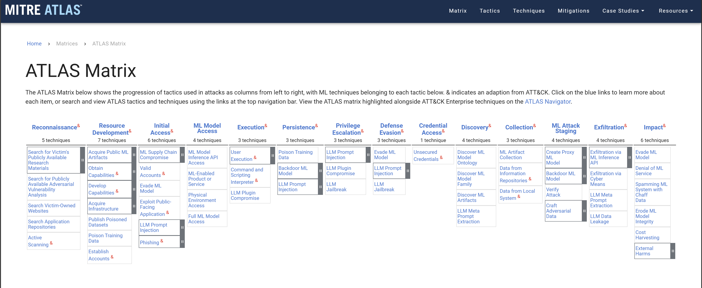
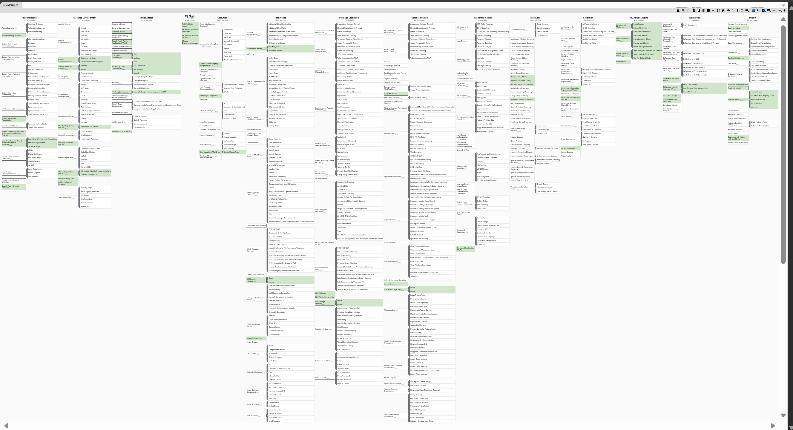
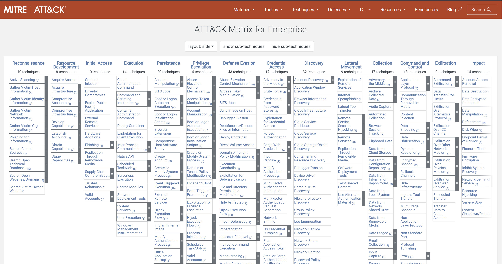

# Amenazas sobre Inteligencia Artificial

## MITRE (

### ATLAS (Adversarial Threat Landscape for Artificial-Intelligence Systems)

[https://atlas.mitre.org/](https://atlas.mitre.org/)

### ATLAS Matrix&#x20;

The ATLAS Matrix below shows the progression of tactics used in attacks as columns from left to right, with ML techniques belonging to each tactic below. & indicates an adaptation from ATT\&CK. Click on the blue links to learn more about each item, or search and view ATLAS tactics and techniques using the links at the top navigation bar. View the ATLAS matrix highlighted alongside ATT\&CK Enterprise techniques

<figure><figcaption></figcaption></figure>

[https://atlas.mitre.org/matrices/ATLAS](https://atlas.mitre.org/matrices/ATLAS)

<figure><figcaption></figcaption></figure>

[https://mitre-atlas.github.io/atlas-navigator/#layerURL=https://raw.githubusercontent.com/mitre-atlas/atlas-navigator-data/main/dist/default-navigator-layers/atlas\_layer\_matrix.json](https://mitre-atlas.github.io/atlas-navigator/#layerURL=https://raw.githubusercontent.com/mitre-atlas/atlas-navigator-data/main/dist/default-navigator-layers/atlas\_layer\_matrix.json)

### ATT\&CK Matrix for Enterprise

[https://attack.mitre.org/](https://attack.mitre.org/)

<figure><figcaption></figcaption></figure>

[https://attack.mitre.org/versions/v15/matrices/enterprise/](https://attack.mitre.org/versions/v15/matrices/enterprise/)

