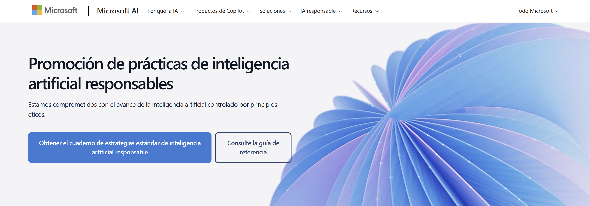
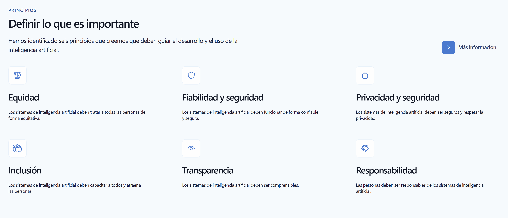
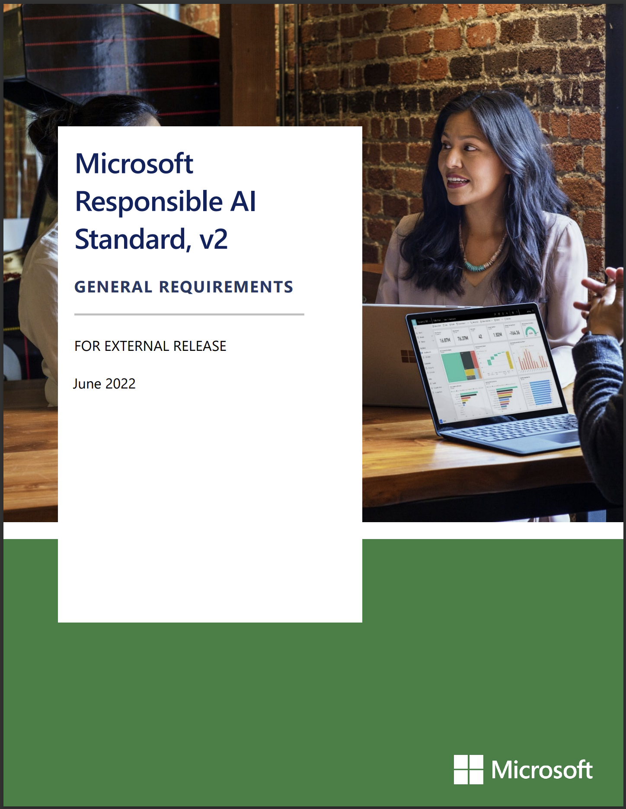
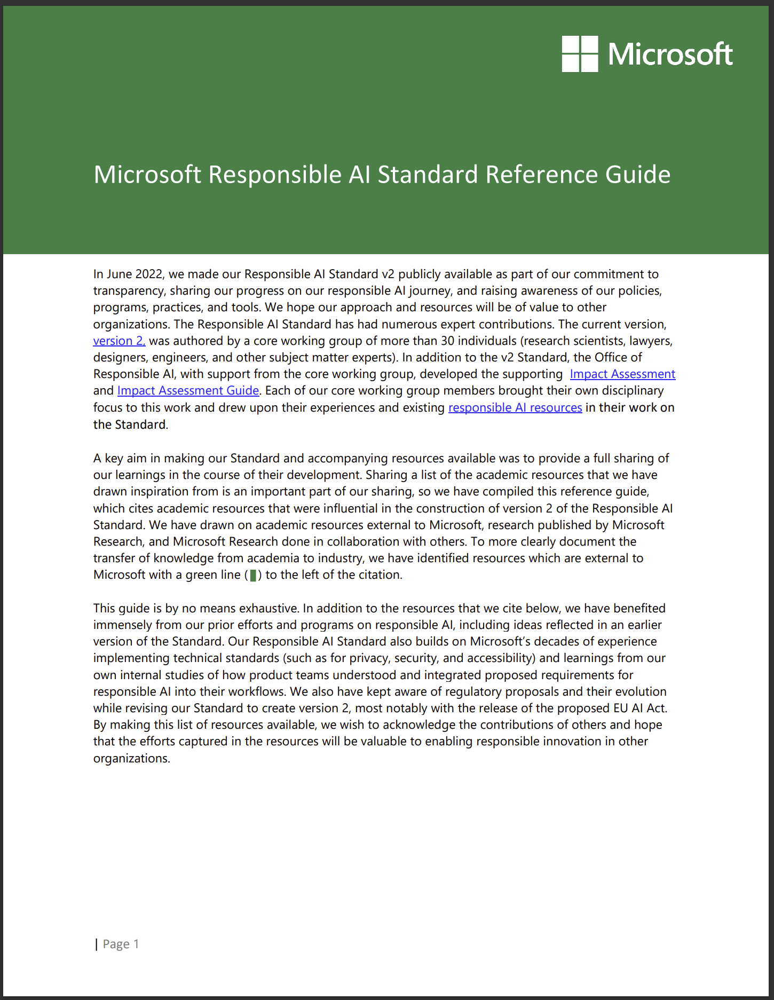

# Inteligencia artificial ética y responsable

## Página Principal Promocion de prácticas de inteligencia artificial responsables

<figure><figcaption></figcaption></figure>

<figure><figcaption></figcaption></figure>

[https://www.microsoft.com/es-mx/ai/responsible-ai](https://www.microsoft.com/es-mx/ai/responsible-ai)

### Documentos Principales

<figure><figcaption></figcaption></figure>

[https://query.prod.cms.rt.microsoft.com/cms/api/am/binary/RE5dlCb](https://query.prod.cms.rt.microsoft.com/cms/api/am/binary/RE5dlCb)

<figure><figcaption></figcaption></figure>

[https://query.prod.cms.rt.microsoft.com/cms/api/am/binary/RE5cmFl](https://query.prod.cms.rt.microsoft.com/cms/api/am/binary/RE5cmFl)

## [Microsoft Privacy](../microsoft-privacy.md)

