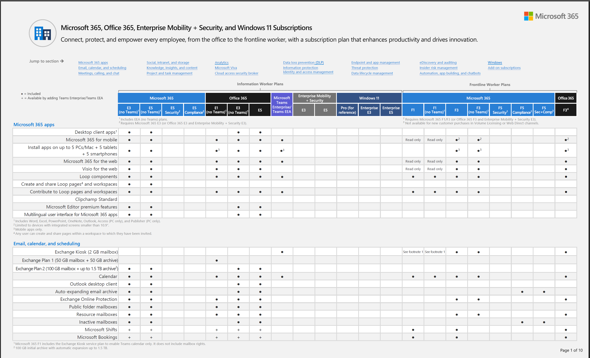
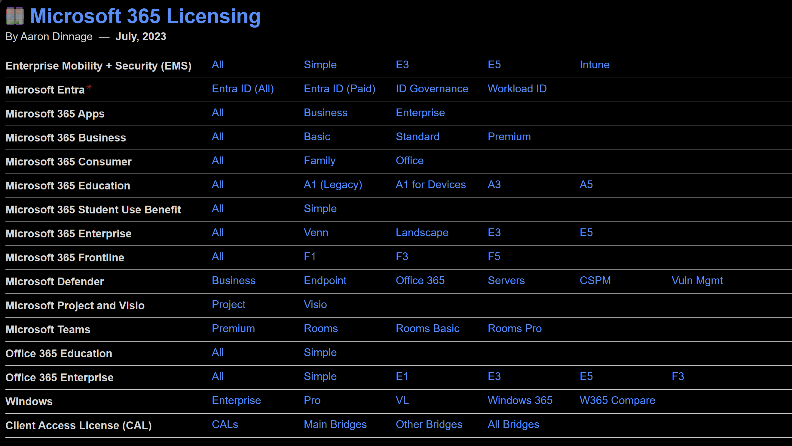
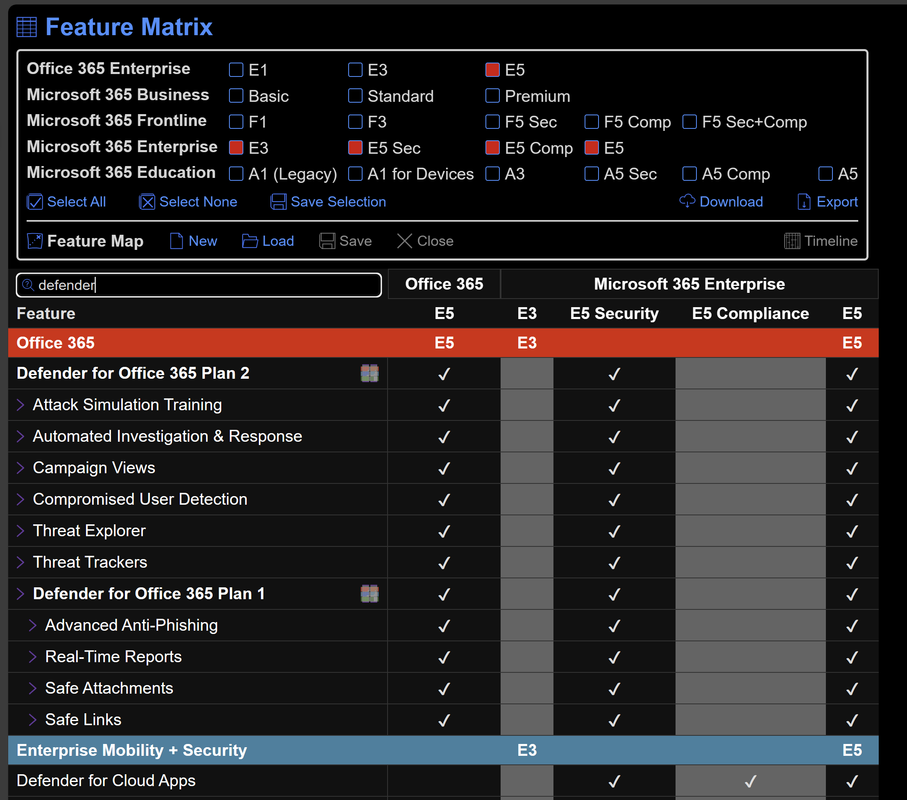

# Licenciamiento Microsoft

## Modern-Work-Plan-Comparison-Enterprise

<figure><figcaption></figcaption></figure>

Link Permanente (se actualiza periodicamente)&#x20;

[https://aka.ms/M365EnterprisePlans](https://aka.ms/M365EnterprisePlans)

## M365Maps

<figure><figcaption></figcaption></figure>

<figure><figcaption></figcaption></figure>

Comparación de Licenciamiento (No oficial)&#x20;

[https://m365maps.com/](https://m365maps.com/)

<figure><figcaption></figcaption></figure>

En la sección de Matriz referencia a las páginas de documentación de la capacidad.

[https://m3documentaciónom/matrix.htm](https://m365maps.com/matrix.htm)

## Licenciamiento Defender for Cloud

## Licenciamiento Azure ARC

## Licenciamiento Sentinel&#x20;

## Guía de Microsoft 365 para Seguridad y Cumplimiento 

#### ¿Qué licencias proporcionan los derechos para que un usuario se beneficie del servicio? 

<figure><figcaption></figcaption></figure>

[https://learn.microsoft.com/es-mx/office365/servicedescriptions/microsoft-365-service-descriptions/microsoft-365-tenantlevel-services-licensing-guidance/microsoft-365-security-compliance-licensing-guidance](https://learn.microsoft.com/es-mx/office365/servicedescriptions/microsoft-365-service-descriptions/microsoft-365-tenantlevel-services-licensing-guidance/microsoft-365-security-compliance-licensing-guidance)

