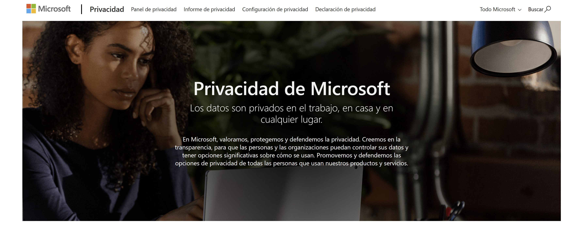

# Microsoft Privacy

## Privacidad de Microsoft

Los datos son privados en el trabajo, en casa y en cualquier lugar.

En Microsoft, valoramos, protegemos y defendemos la privacidad. Creemos en la transparencia, para que las personas y las organizaciones puedan controlar sus datos y tener opciones significativas sobre cómo se usan. Promovemos y defendemos las opciones de privacidad de todas las personas que usan nuestros productos y servicios

<figure><figcaption></figcaption></figure>

[https://privacy.microsoft.com/es-mx](https://privacy.microsoft.com/es-mx)

[https://privacy.microsoft.com/en-us](https://privacy.microsoft.com/en-us)

## Declaración de privacidad de Microsoft

_Su privacidad es importante para nosotros. Esta declaración de privacidad explica cuáles son los datos personales que recopila Microsoft, cómo los trata y con qué fines lo hace._

_Microsoft ofrece una amplia gama de productos, entre los que se incluyen productos de servidor usados para ayudar a funcionar a empresas de todo el mundo, dispositivos de uso doméstico, software que los estudiantes emplean en su centro educativo y desarrolladores de servicios, cuya finalidad es crear y hospedar lo que está por venir. Entre las referencias a productos de Microsoft usadas en esta declaración se encuentran los servicios, los sitios web, las aplicaciones, el software, los servidores y los dispositivos de Microsoft._

_Consulte los detalles específicos de cada producto en esta declaración de privacidad, que ofrecen información adicional relevante. Esta declaración se aplica a las interacciones de Microsoft con usted y a los productos de Microsoft enumerados a continuación, así como a otros productos de Microsoft en los que figure esta declaración._

[https://privacy.microsoft.com/es-mx/privacystatement](https://privacy.microsoft.com/es-mx/privacystatement)

## Informe de privacidad de Microsoft

#### Impulsar la innovación en IA protegiendo la privacidad

_Microsoft seguirá comprometido a impulsar una innovación responsable de la inteligencia artificial, al tiempo que protege la privacidad y otros derechos fundamentales, desarrolla herramientas para el uso y el control de los datos, proporciona transparencia y elección, y responde al cambiante panorama de privacidad al servicio de nuestros clientes y del sector en general._

_En todo el mundo, seguimos viendo una aceleración de la protección de datos y la normativa de privacidad junto con avances rápidos en nuevos tipos de tecnologías que aprovechan los datos. Nuestros clientes siguen interesados en los últimos desarrollos en sistemas y soluciones de inteligencia artificial avanzados que satisfacen sus necesidades únicas de uso y gobernanza de datos._

_En Microsoft, creemos que la inteligencia artificial es la tecnología de definición de nuestro tiempo. La protección de la privacidad es un componente fundamental de los sistemas avanzados de inteligencia artificial. Hemos tenido una estructura y un sistema de gobernanza de la inteligencia artificial basados en principios en toda la empresa desde 2017, y hoy tenemos cientos de empleados en toda la empresa, de varias materias, incluida la investigación, la directiva y la ingeniería, que están trabajando para garantizar que nuestra_ [_Las soluciones de inteligencia artificial satisfacen las expectativas de la sociedad y nuestros principios éticos_](https://blogs.microsoft.com/on-the-issues/2023/05/01/responsible-ai-standards-principles-governance-progress/)_._

_A medida que avancemos rápidamente en inteligencia artificial, seguiremos desarrollando nuestras soluciones en consonancia con nuestros principios éticos, las directivas corporativas y los compromisos voluntario para promover la inteligencia artificial segura, protegida y transparente. Un aspecto fundamental de nuestros esfuerzos es nuestra adherencia a nuestro_ [_Estándar de IA responsable_](https://blogs.microsoft.com/on-the-issues/2022/06/21/microsofts-framework-for-building-ai-systems-responsibly/)_, que describe los requisitos específicos para desarrollar e implementar sistemas de inteligencia artificial. El estándar guía a nuestros equipos internos transformando nuestros principios de inteligencia artificial de equidad, confiabilidad y seguridad, privacidad y seguridad, inclusión, transparencia y responsabilidad en prácticas de ingeniería concretas. Como parte de nuestro compromiso con la transparencia, Microsoft ha_ [_actualizado_](https://privacy.microsoft.com/updates) _la Declaración de privacidad de Microsoft y ha publicado_ [_El nuevo Bing: nuestro enfoque para la IA responsable_](https://aka.ms/ResponsibleAI-NewBing)_. Microsoft también publica_ [_Notas de transparencia_](https://learn.microsoft.com/legal/cognitive-services/openai/transparency-note) _para nuestras otras soluciones de inteligencia artificial, para ayudarle a comprender cómo funciona nuestra tecnología de IA de plataforma, las opciones que nuestros clientes pueden tomar que influyen en el rendimiento y el comportamiento, y cómo garantizamos que las soluciones avancen en la protección de la privacidad._

_Además de nuestras prácticas internas, Microsoft admite iniciativas normativas globales para garantizar que la inteligencia artificial se desarrolle y use de formas responsables, de protección de la privacidad y éticas. En los Estados Unidos, Microsoft ha_ [_confirmado el apoyo a los compromisos de inteligencia artificial voluntaria de la Casa Blanca_](https://blogs.microsoft.com/on-the-issues/2023/07/21/commitment-safe-secure-ai/) _y respalda los esfuerzos y la visión en Europa, el Reino Unido y otras jurisdicciones a medida que trabajan para desarrollar marcos basados en riesgos que garanticen que las personas puedan cumplir las promesas de la inteligencia artificial de forma responsable y de maneras que respeten los derechos fundamentales._

_Hemos estado a la vanguardia en la investigación de vanguardia en inteligencia artificial e integrado estas tecnologías de inteligencia artificial eficaces e innovadoras en nuestros productos y servicios para ayudar a los clientes a hacer más cosas a la vez que conservamos la privacidad, la transparencia y la confianza de los datos._ [_IA de Microsoft_](https://www.microsoft.com/en-us/ai)_, Funciona con_ [_Azure_](https://azure.microsoft.com/en-us/free/search/?OCID=AIDcmm5edswduu\_SEM\_b48f73c428ab10a90d1e1022a0218397)_, proporciona miles de millones de experiencias inteligentes cada día en Windows, Xbox, Microsoft 365, Teams,_ [_Azure AI_](https://azure.microsoft.com/en-ca/solutions/ai/)_, Power Platform, Dynamics 365 y Microsoft Defender._

[https://privacy.microsoft.com/es-mx/privacy-report](https://privacy.microsoft.com/es-mx/privacy-report)

