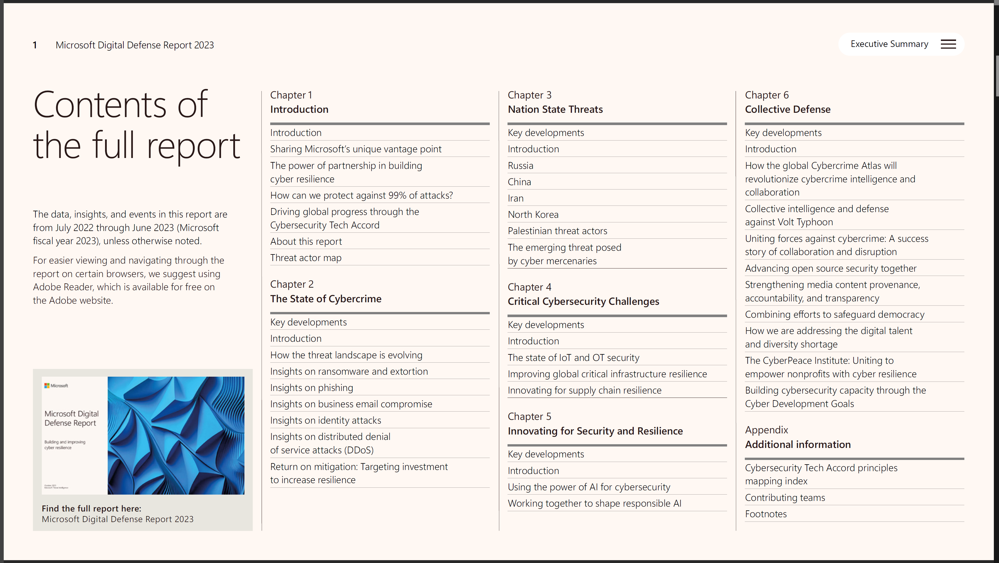

# Reportes de Inteligencia Microsoft

## Microsoft Security Insider

[https://www.microsoft.com/en-us/security/business/security-insider/](https://www.microsoft.com/en-us/security/business/security-insider/)

## Reportes de Inteligencia

[https://www.microsoft.com/en-us/security/security-insider/intelligence-reports/](https://www.microsoft.com/en-us/security/security-insider/intelligence-reports/)

### Microsoft Digital Defense Report (MDDR) >> Octubre 2023

[https://www.microsoft.com/en-us/security/security-insider/microsoft-digital-defense-report-2023](https://www.microsoft.com/en-us/security/security-insider/microsoft-digital-defense-report-2023)

<figure><figcaption></figcaption></figure>

Reporte completo

[https://go.microsoft.com/fwlink/?linkid=2249025\&clcid](https://go.microsoft.com/fwlink/?linkid=2249025\&clcid=0x409\&culture=en-us\&country=us)

## Microsoft Cyber Signals

### Cyber Signals 6: Navigating cyberthreats and strengthening defenses in the era of AI >> Febrero 2024

<figure><figcaption></figcaption></figure>

[https://www.microsoft.com/en-us/security/blog/2024/02/14/cyber-signals-navigating-cyberthreats-and-strengthening-defenses-in-the-era-of-ai/](https://www.microsoft.com/en-us/security/blog/2024/02/14/cyber-signals-navigating-cyberthreats-and-strengthening-defenses-in-the-era-of-ai/)

Reporte completo:

[https://www.microsoft.com/en-us/security/business/security-insider/wp-content/uploads/2024/02/cyber-signals-issue-6.pdf](https://www.microsoft.com/en-us/security/business/security-insider/wp-content/uploads/2024/02/cyber-signals-issue-6.pdf)
