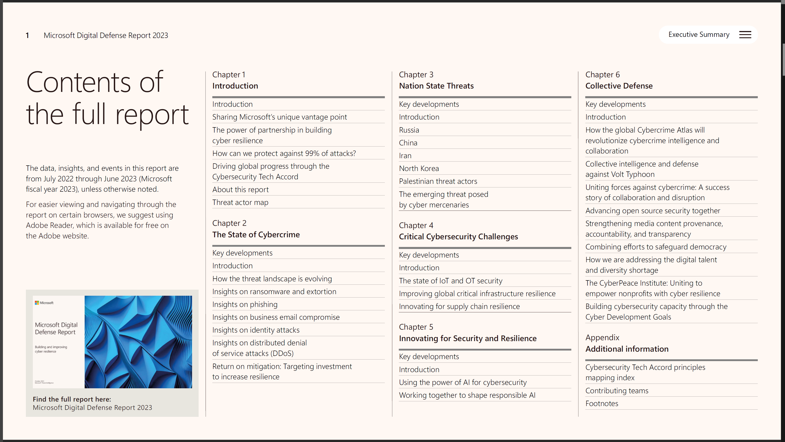

# Reportes de Inteligencia Microsoft

## Microsoft Security Insider

[https://www.microsoft.com/en-us/security/business/security-insider/](https://www.microsoft.com/en-us/security/business/security-insider/)

<figure><figcaption></figcaption></figure>

### Threat Briefs

#### 2023 Threat Intelligence Year in Review: Key Insights and Developments >> Marzo 2024

[https://www.microsoft.com/en-us/security/business/security-insider/threat-briefs/2023-threat-intelligence-year-in-review-key-insights-and-development/](https://www.microsoft.com/en-us/security/business/security-insider/threat-briefs/2023-threat-intelligence-year-in-review-key-insights-and-development/)

### Reportes de Inteligencia

[https://www.microsoft.com/en-us/security/security-insider/intelligence-reports/](https://www.microsoft.com/en-us/security/security-insider/intelligence-reports/)

#### Microsoft Digital Defense Report (MDDR) >> Octubre 2023

[https://www.microsoft.com/en-us/security/security-insider/microsoft-digital-defense-report-2023](https://www.microsoft.com/en-us/security/security-insider/microsoft-digital-defense-report-2023)

<figure><figcaption></figcaption></figure>

| The state of cybercrime                 | Innovation for security and Resilience  |
| --------------------------------------- | --------------------------------------- |
|  |  |

Reporte completo

[https://go.microsoft.com/fwlink/?linkid=2249025\&clcid](https://go.microsoft.com/fwlink/?linkid=2249025\&clcid=0x409\&culture=en-us\&country=us)

#### Ciber Resiliencia > Resistencia cibernética > Diciembre 2022

[https://www.microsoft.com/es-mx/security/security-insider/intelligence-reports/5-steps-to-cyber-resilience/](https://www.microsoft.com/es-mx/security/security-insider/intelligence-reports/5-steps-to-cyber-resilience/#section-master-oc8dc6)

<figure><figcaption></figcaption></figure>

Reporte completo&#x20;

[https://query.prod.cms.rt.microsoft.com/cms/api/am/binary/RE4Y4h3](https://query.prod.cms.rt.microsoft.com/cms/api/am/binary/RE4Y4h3)

